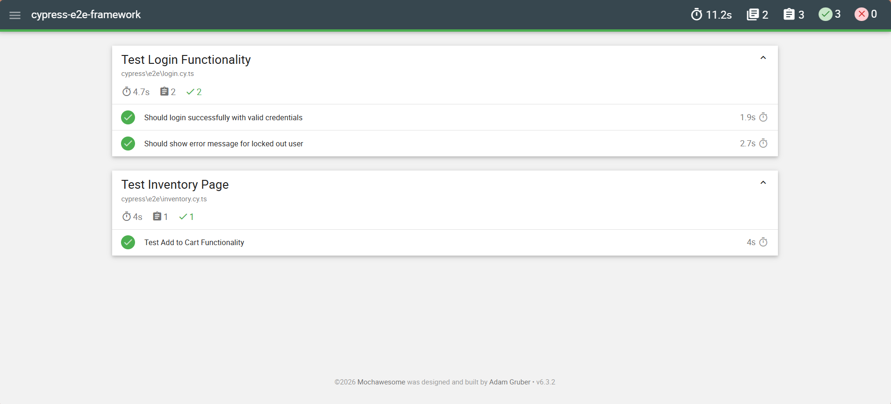
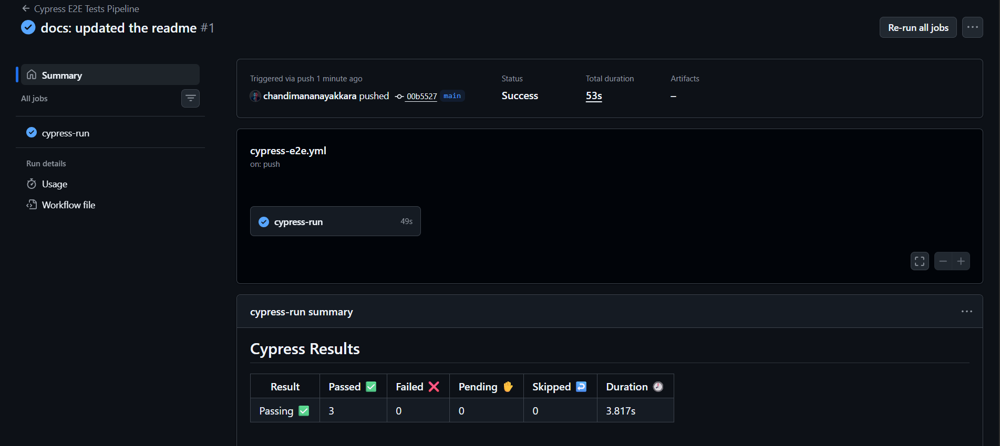

# Enterprise E-Commerce Cypress Framework 🚀

A robust, industry-standard End-to-End (E2E) automation framework built for an E-Commerce application (Saucedemo). 

## 🛠️ Tech Stack & Architecture
* **Automation Tool:** Cypress
* **Language:** TypeScript
* **Design Pattern:** Page Object Model (POM)
* **Test Data Management:** Cypress Fixtures (Data-Driven Testing)
* **CI/CD:** GitHub Actions
* **Reporting:** Mochawesome HTML Reports

## 📊 Test Execution Report
*(Mochawesome HTML Report Output)*

## 📂 Framework Structure
- `cypress/e2e/` - Contains all test spec files
- `cypress/pages/` - Page Object Model classes (Getters and Actions)
- `cypress/fixtures/` - JSON files for Data-Driven Testing
- `cypress/support/` - Custom commands and global configurations

## 🚀 How to Run Locally
1. Clone the repository.
2. Install dependencies: `npm install`
3. Run in interactive mode: `npx cypress open`
4. Run in headless mode (with reports): `npx cypress run`

## ⚙️ CI/CD Pipeline (GitHub Actions)
This project is fully integrated with **GitHub Actions**. Upon every push or pull request to the main branch, the Cypress test suite is automatically triggered and executed in a cloud container.

